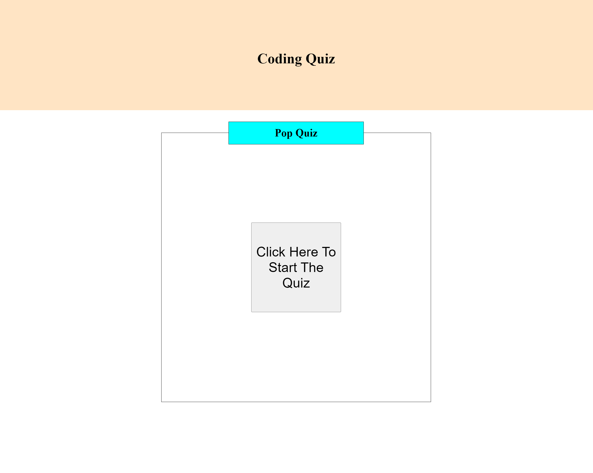

# coding-quiz

## Descripion

For this project the user can take a timed quiz and score points. Once the quiz is done the user can save their score. Then they can try the quiz again if they choose or reset all the scores. 

## technologys

The webpage uses HTML, CSS, and JavaScript

## learned

I learned how to make the webpage interactable and how JavaScript can change the webpage.

## Task

GIVEN I am taking a code quiz
WHEN I click the start button
THEN a timer starts and I am presented with a question
WHEN I answer a question
THEN I am presented with another question
WHEN I answer a question incorrectly
THEN time is subtracted from the clock
WHEN all questions are answered or the timer reaches 0
THEN the game is over
WHEN the game is over
THEN I can save my initials and my score

## Struggles 

The biggest struggle that I ran into during this project was makeing the reset button apply to all the scores and not just one. 

## Usage

By clicking the start button after loading the page a quiz will begin. Click the correct answer to get points. If you click an incorrect answer then you will get a 5 second time penalty and no points. When the time is up or you finish all the questions you will be asked for your initials and the hiscores page will be displayed with your score. If you press the reset button it will clear all the scores. If you press the retake button you can take the quiz again.

## Webpage
https://hayessea000.github.io/coding-quiz/
